# Client Context Finder

A modern, AI-powered client analytics platform for tracking fund digitization projects, client engagement metrics, and generating intelligent business insights.

## Screenshots

### Authentication

*Secure Google OAuth authentication*

### Dashboard Views (Multi-Theme Support)

#### Light Theme
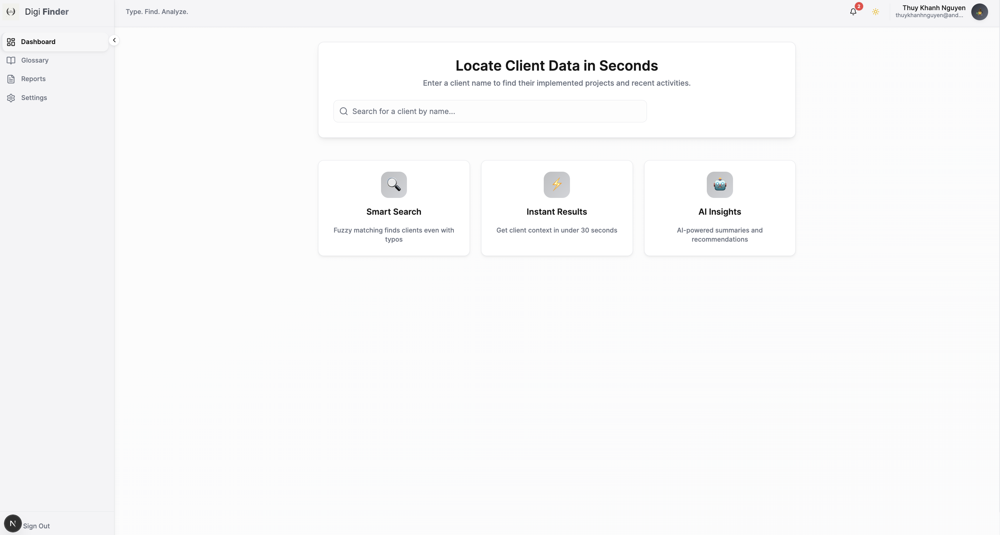
*Clean, professional light mode with high contrast*

#### Dark Theme
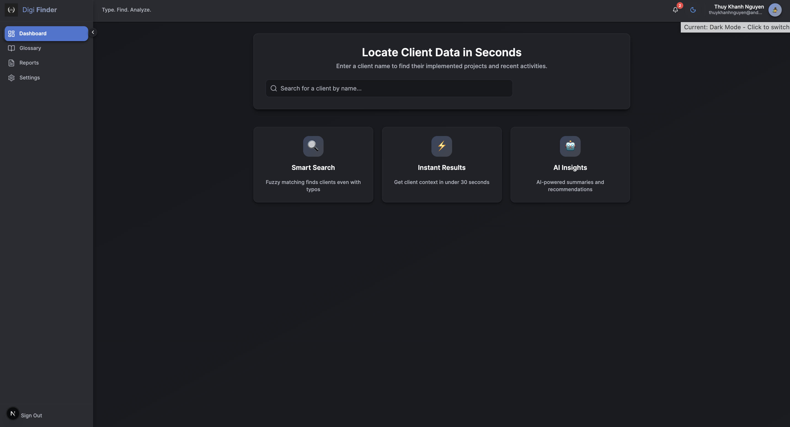
*Modern dark mode with luminous accents*

#### Asian Theme

*Warm, earthy tones with terracotta accents*

### Client Search
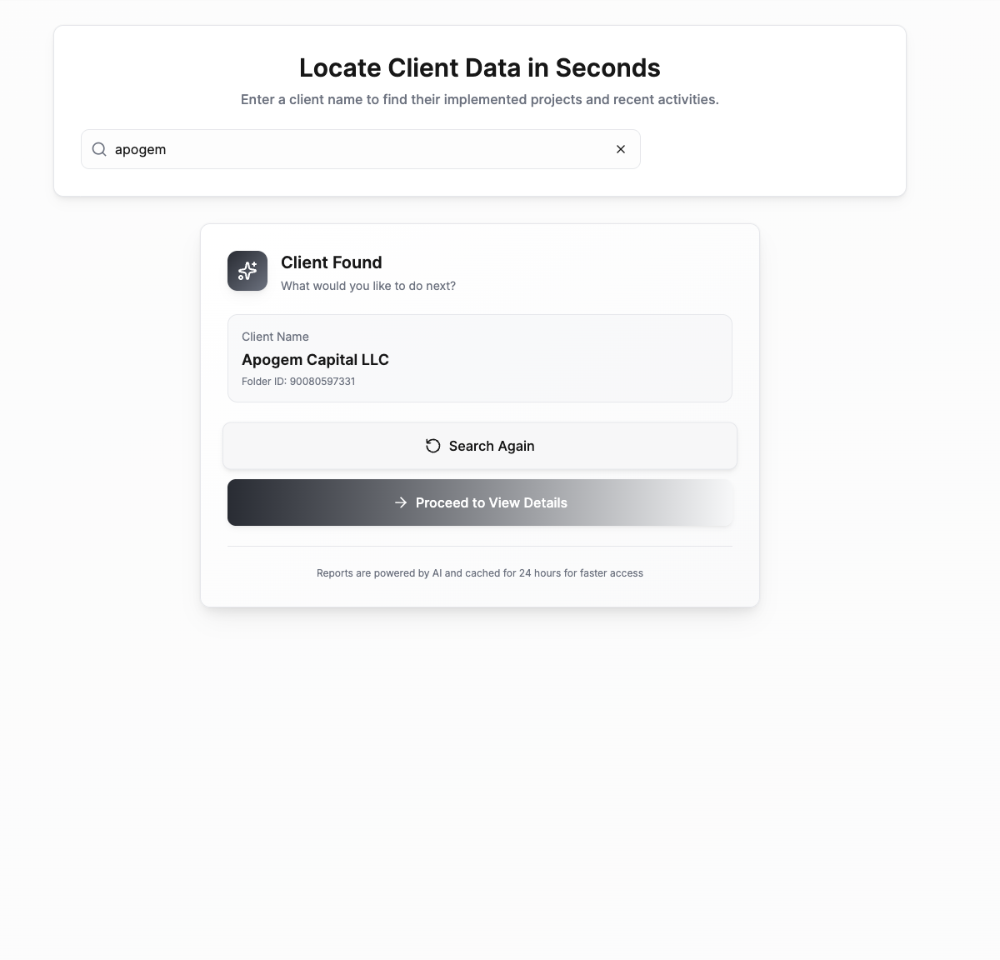
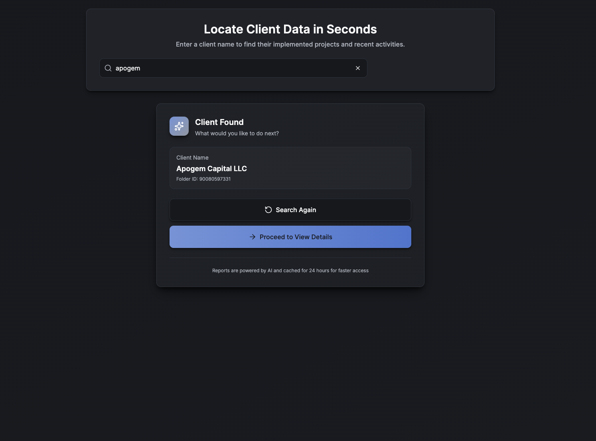
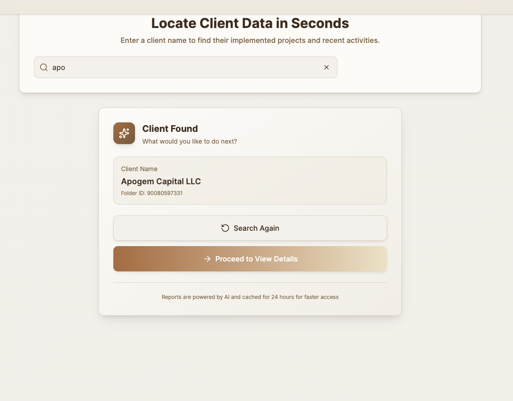
*Smart fuzzy search with real-time results*

### Settings Page
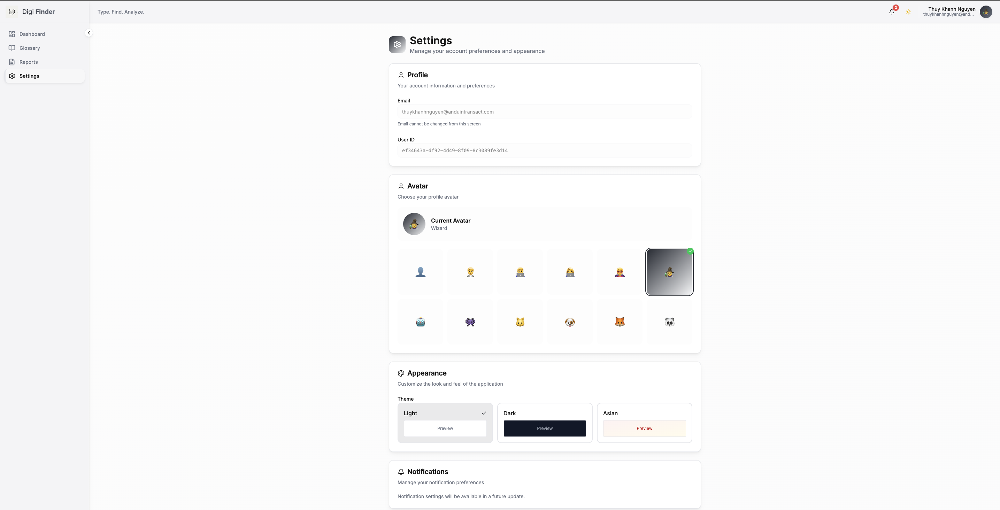
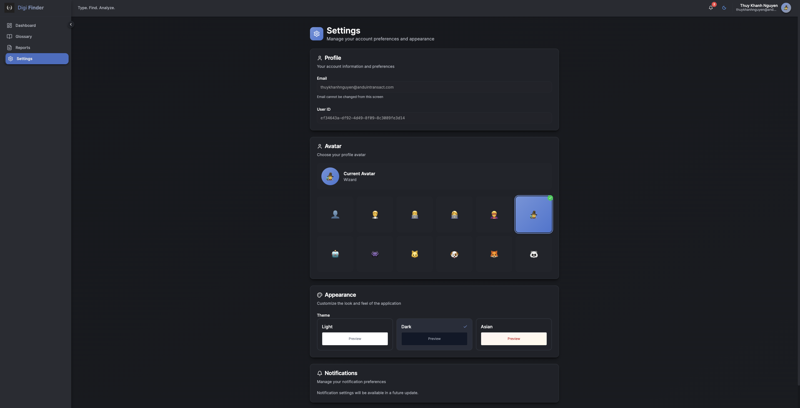

*Theme customization and user preferences*

### Glossary
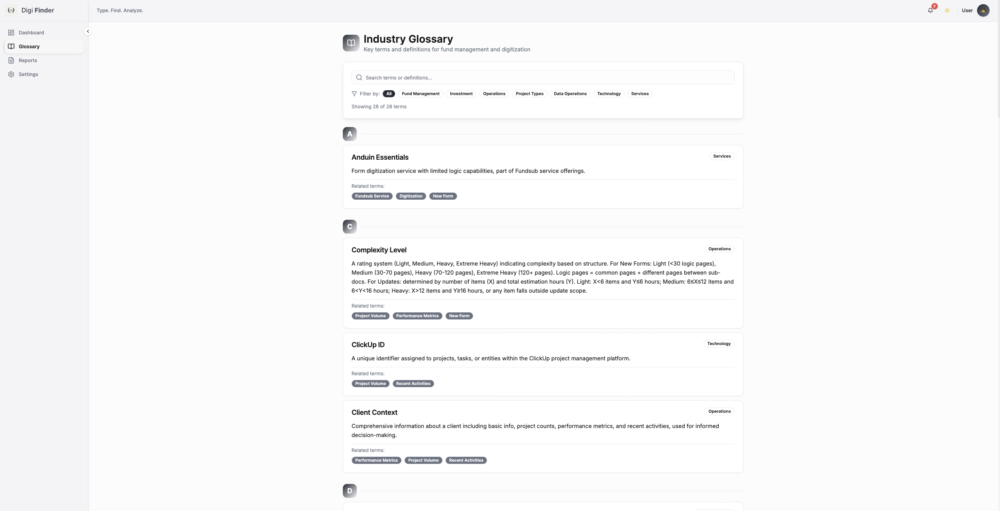


*Built-in terminology reference*

### Reports & AI Features
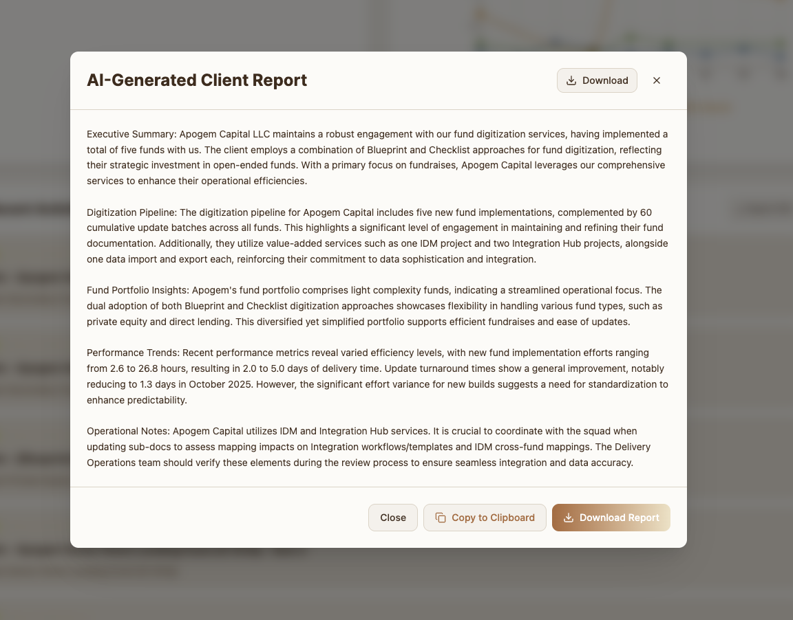
*GPT-4o powered business insights and recommendations*

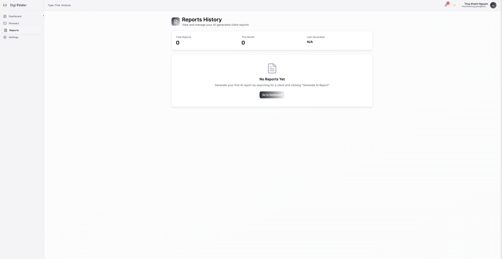
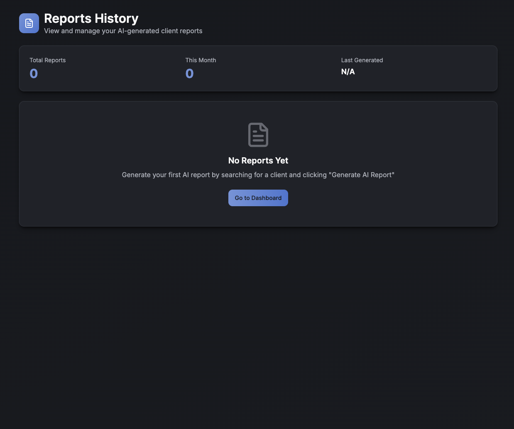
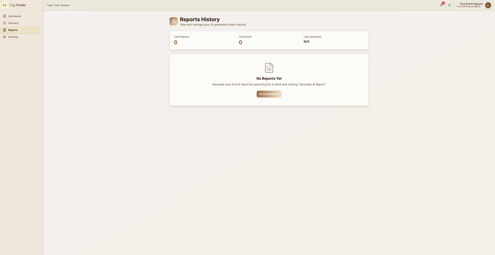
*Access and manage previously generated reports*

## Features

- **Smart Client Search** - Fuzzy matching algorithm for quick client lookup
- **Comprehensive Analytics** - Project volume, performance metrics, and activity tracking
- **AI-Powered Reports** - GPT-4o generated business insights and recommendations
- **Multi-Theme UI** - Three distinct themes (Light, Dark, Asian) with WCAG 2.1 AA compliance
- **Auto-Save Notes** - Client-specific notes with automatic persistence
- **Search History** - Track and revisit recent searches
- **Reports Archive** - Access previously generated AI reports
- **CSV Exports** - Export data from all sections
- **Glossary** - Built-in terminology reference
- **PDF Export** - Download complete client reports as PDF

## Tech Stack

- **Framework**: Next.js 16 (App Router with Turbopack)
- **Language**: TypeScript
- **Styling**: Tailwind CSS with custom theme system
- **Authentication**: Supabase Auth (JWT)
- **Database**: Supabase (PostgreSQL)
- **Analytics**: ClickHouse Cloud
- **AI**: OpenAI GPT-4o
- **Data Source**: Google Sheets API
- **Charts**: Recharts
- **Validation**: Zod

## Prerequisites

Before you begin, ensure you have:

- **Node.js** 18.x or higher
- **npm** or **yarn** package manager
- **Supabase** account and project
- **ClickHouse Cloud** account
- **OpenAI** API key
- **Google Cloud** service account with Sheets API access

## Setup Instructions

### 1. Clone the Repository

```bash
git clone https://github.com/khoai-code/KKK.git
cd KKK
```

### 2. Install Dependencies

```bash
npm install
```

### 3. Environment Variables

Create a `.env.local` file in the root directory:

```bash
# Supabase Configuration
NEXT_PUBLIC_SUPABASE_URL=your_supabase_project_url
NEXT_PUBLIC_SUPABASE_ANON_KEY=your_supabase_anon_key
SUPABASE_SERVICE_ROLE_KEY=your_supabase_service_role_key

# ClickHouse Configuration
CLICKHOUSE_API_URL=https://your-instance.clickhouse.cloud:8443
CLICKHOUSE_AUTH_BASIC=your_basic_auth_token
CLICKHOUSE_CF_CLIENT_ID=your_client_id
CLICKHOUSE_CF_CLIENT_SECRET=your_client_secret
CLICKHOUSE_ACCOUNT_NAME=your_account_name
CLICKHOUSE_ACCOUNT_PASSWORD=your_account_password

# OpenAI Configuration
OPENAI_API_KEY=your_openai_api_key
OPEN_API_URL=https://api.openai.com/v1
AI_MODEL=gpt-4o

# Google Sheets Configuration
GOOGLE_SHEETS_PRIVATE_KEY=your_service_account_private_key
GOOGLE_SHEETS_CLIENT_EMAIL=your_service_account_email
GOOGLE_SHEETS_SPREADSHEET_ID=your_spreadsheet_id
```

### 4. Database Setup

Run the Supabase migrations to set up the database schema:

```bash
# If using Supabase CLI
npx supabase db push

# Or manually execute the migrations in your Supabase SQL editor:
# - supabase/migrations/20251027_init_schema.sql
# - supabase/migrations/create_client_notes.sql
# - supabase/migrations/create_search_history.sql
# - supabase/migrations/20251029_add_reports_history.sql
```

**Database Tables Created:**
- `client_notes` - User-specific client notes
- `search_history` - Recent client searches (max 5 per user)
- `reports_history` - Generated AI reports archive

### 5. Google Sheets Setup

1. Create a Google Cloud service account
2. Enable Google Sheets API
3. Share your Google Sheet with the service account email
4. Add the credentials to `.env.local`

**Required Sheet Structure:**
- Column: `Folder ID` - Unique client identifier
- Column: `Client Folder Name` - Client display name
- Additional columns as needed for client data

### 6. ClickHouse Setup

Ensure your ClickHouse instance has the required table:
- `dbt_int.int_digitization_consolidate` - Main analytics table

**Required Columns:**
- `folder_id`, `entity_to_create_fund`, `clickup_id`, `fund_name`
- `task_group`, `name`, `complexity_level`, `due_date`, `start_date`
- `effort_hour`, `digitization_process_version`, `law_firm`, `fund_admin`
- `partner`, `investment_type`, `fund_structure`, `fund_engagement`

### 7. Run Development Server

```bash
npm run dev
```

Open [http://localhost:3000](http://localhost:3000) in your browser.

### 8. Build for Production

```bash
npm run build
npm start
```

## Deployment

### Deploy to Vercel (Recommended)

1. **Push to GitHub** (already done)
   ```bash
   git push origin main
   ```

2. **Import to Vercel**
   - Visit [vercel.com/new](https://vercel.com/new)
   - Select your GitHub repository
   - Vercel will auto-detect Next.js

3. **Configure Environment Variables**
   - Go to Project Settings → Environment Variables
   - Add all variables from `.env.local` (see template above)
   - Make sure to add them for Production, Preview, and Development

4. **Deploy**
   - Click "Deploy"
   - Wait 2-3 minutes for build to complete
   - Your app will be live at `https://your-project.vercel.app`

5. **Post-Deployment Testing**
   - Test login/signup flow
   - Search for a client
   - Generate an AI report
   - Test theme switching
   - Verify CSV exports

### Deploy to Other Platforms

The application can also be deployed to:
- **Netlify** - Configure build command: `npm run build`
- **Railway** - Auto-detected Next.js deployment
- **AWS Amplify** - Connect GitHub repo
- **Self-hosted** - Use `npm run build` and `npm start` with PM2

## Project Structure

```
├── app/                          # Next.js App Router
│   ├── (auth)/                   # Authentication pages
│   │   ├── login/
│   │   └── signup/
│   ├── (dashboard)/              # Protected dashboard pages
│   │   └── dashboard/
│   │       ├── client/[folderId]/  # Client details page
│   │       ├── glossary/           # Terminology reference
│   │       ├── reports/            # Reports history
│   │       └── settings/           # User settings
│   ├── api/                      # API routes
│   │   ├── auth/                 # Authentication endpoints
│   │   ├── client-context/       # Client data fetching
│   │   ├── client-notes/         # Notes CRUD
│   │   ├── generate-report/      # AI report generation
│   │   ├── search-client/        # Client search
│   │   └── search-history/       # Search history CRUD
│   └── globals.css               # Global styles & theme system
├── components/                   # React components
│   ├── auth/                     # Login/signup forms
│   ├── client/                   # Client detail components
│   ├── dashboard/                # Dashboard components
│   ├── layout/                   # Sidebar, TopBar
│   ├── search/                   # Search components
│   ├── theme/                    # Theme switcher
│   └── ui/                       # Reusable UI components
├── lib/
│   ├── api/                      # API integrations
│   │   ├── clickhouse.ts         # ClickHouse queries
│   │   ├── google-sheets.ts      # Google Sheets client
│   │   └── openai.ts             # OpenAI integration
│   ├── context/                  # React context providers
│   ├── supabase/                 # Supabase clients
│   ├── types/                    # TypeScript types
│   └── utils/                    # Utility functions
├── supabase/migrations/          # Database migrations
├── public/                       # Static assets
└── middleware.ts                 # Auth middleware
```

## Available Scripts

- `npm run dev` - Start development server (port 3000)
- `npm run build` - Build for production
- `npm start` - Start production server
- `npm run lint` - Run ESLint

## Key Features Explained

### Theme System

Three distinct themes with CSS variables:
- **Light Mode** - Clean white background (#FCFCFC), high contrast
- **Dark Mode** - Deep charcoal (#16181D), luminous accents
- **Asian Mode** - Warm beige (#F2EBE3), terracotta accents

Toggle themes from Settings or TopBar. Preference saved to localStorage.

### AI Report Generation

Uses OpenAI GPT-4o to analyze client data and generate:
1. Executive Summary
2. Digitization Pipeline Analysis
3. Fund Portfolio Insights
4. Performance Trends
5. Operational Notes

Reports are cached in `reports_history` table for future reference.

### Caching Strategy

- **ClickHouse queries**: 24-hour in-memory cache
- **Google Sheets data**: Fetched per request
- **AI reports**: Saved to database after generation

### Security Features

- ✅ Supabase JWT authentication on all protected routes
- ✅ SQL injection prevention (manual escaping)
- ✅ Input validation with Zod on API endpoints
- ✅ Server-side environment variables only
- ✅ CORS protection via Next.js
- ⚠️ Rate limiting not implemented (recommended for production)

## Troubleshooting

### Build Errors

**TypeScript errors during build:**
```bash
# tsconfig.json has "strict": false for Supabase compatibility
# If you encounter type errors, ensure you're using the correct types
```

**Supabase type errors:**
```bash
# Generate fresh types
npx supabase gen types typescript --project-id your_project_id > lib/types/database.types.ts
```

### Runtime Errors

**ClickHouse connection fails:**
- Verify `CLICKHOUSE_API_URL` includes protocol and port (`:8443`)
- Check that `CLICKHOUSE_AUTH_BASIC` is base64 encoded `username:password`

**Google Sheets 403 error:**
- Ensure service account email has access to the sheet
- Verify `GOOGLE_SHEETS_PRIVATE_KEY` includes `\n` characters properly

**Supabase authentication fails:**
- Check that `NEXT_PUBLIC_SUPABASE_URL` and `NEXT_PUBLIC_SUPABASE_ANON_KEY` are public
- Verify `SUPABASE_SERVICE_ROLE_KEY` is kept secret (server-side only)

**AI report generation fails:**
- Verify `OPENAI_API_KEY` is valid
- Check OpenAI account has sufficient credits
- Ensure model `gpt-4o` is available to your account

### Performance Issues

**Slow client searches:**
- Google Sheets API has rate limits (default: 100 requests/100 seconds)
- Consider implementing Redis cache for frequently accessed data

**ClickHouse queries timeout:**
- Default timeout is 30 seconds
- Optimize queries in `lib/api/clickhouse.ts`
- Check ClickHouse Cloud instance performance tier

## Documentation

- **[DEPLOYMENT_READY.md](DEPLOYMENT_READY.md)** - Production readiness checklist
- **[DEPLOYMENT_CHECKLIST.md](DEPLOYMENT_CHECKLIST.md)** - Step-by-step deployment guide
- **[TESTING_AND_SECURITY_REPORT.md](TESTING_AND_SECURITY_REPORT.md)** - Security analysis & testing
- **[IMPLEMENTATION_GUIDE.md](IMPLEMENTATION_GUIDE.md)** - Feature implementation details

## Known Limitations

1. **Rate Limiting** - Not implemented. Recommended for production use.
2. **Error Monitoring** - Sentry not configured. Add for production monitoring.
3. **E2E Tests** - Manual testing required. Playwright tests not implemented.
4. **Supabase Types** - Using `as any` workarounds in some operations.

## Future Enhancements

- [ ] Upstash Redis rate limiting
- [ ] Sentry error monitoring
- [ ] Playwright E2E tests
- [ ] Advanced filters for client search
- [ ] Bulk report generation
- [ ] Email notifications for reports
- [ ] Client comparison view
- [ ] Export to PDF/Excel with charts

## License

This project is proprietary software. All rights reserved.

## Support

For issues or questions:
- Review the troubleshooting section above
- Check documentation files in the project root
- Consult API documentation for third-party services

---

**Built with** Next.js 16, TypeScript, Supabase, ClickHouse, and OpenAI GPT-4o

**Generated with** [Claude Code](https://claude.com/claude-code)
